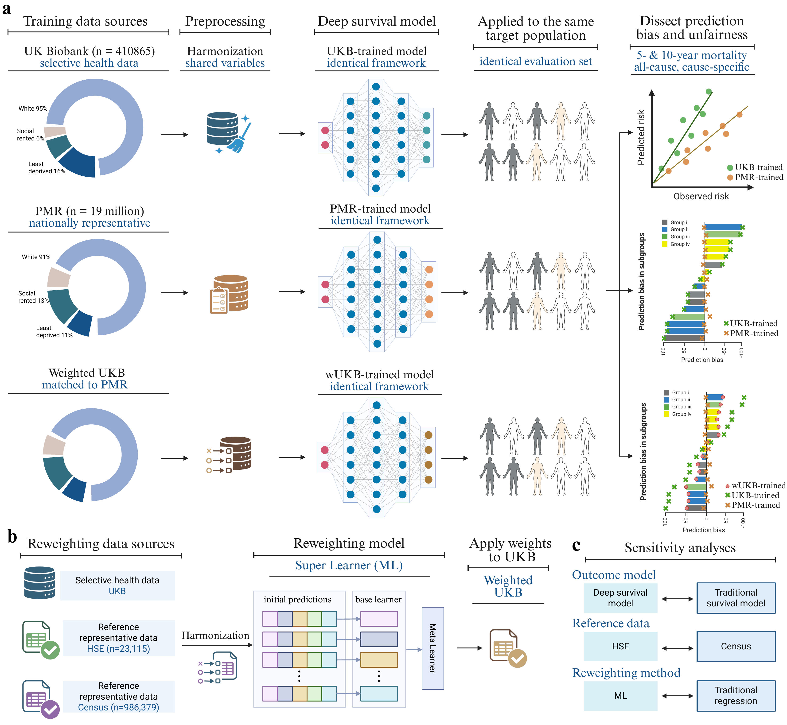

# Selective health data drive bias and unfairness in mortality prediction

Shujuan Chen, Yue Li and Ying Jin

This repository contains the analysis code and detailed implementation instructions for the manuscript *Selective health data drive bias and unfairness in mortality prediction*. The study examines whether there is prediction bias in deep learning mortality models arising from selective health data, whether the resulting bias differs across sociodemographic groups, and whether this bias can be corrected. The overall study design is shown in Figure 1.

Please refer to the [Overview](#overview) section below for the layout of this repository, which includes a tutorial for reproducing the study results, a tutorial for bias correction, the system requirements, the installation guide, a demonstration on simulated data, and the instructions for use.



<sub>**Figure 1. Overall study design. a,** To dissect prediction bias arising from selective training data, we designed a controlled benchmark framework in which the training dataset varied while the modelling framework, predictors, outcomes, and evaluation population were held constant. Mortality models were trained on selective health data from UK Biobank (UKB) and, separately, on the nationally representative benchmark dataset, the personal-level mortality registrations (PMR) linked with census. Both models were then deployed to the same target population, PMR, to predict mortality risk. Prediction bias was estimated by comparing predicted risk with observed mortality. PMR-trained model served as a representative benchmark to verify whether the same modelling framework produced well-calibrated predictions when trained on representative data. **b,** To assess bias correction, UKB was reweighted to better resemble the wider target population using two additional representative reference datasets. Super Learner was used to estimate participation weights. **c,** Sensitivity analyses assessed whether the main findings were robust to alternative prediction models, reference datasets, and weighting methods.</sub>

## Overview

Tutorial 1 and Tutorial 2 are step-by-step guides. Tutorial 1 shows how to run the analysis code that reproduces the study results, and Tutorial 2 shows how to generate the UK Biobank participation weights. Both provide a detailed demonstration guide of the code using the simulated data without any restricted-data access. The remaining sections describe the software requirements, the installation procedure, the data and access routes, the file layout and the licence.

- [Tutorial 1: how to run the analysis code for the study results](#tutorial-1-how-to-run-the-analysis-code-for-the-study-results)
- [Tutorial 2: how to generate the UKB participation weights](#tutorial-2-how-to-generate-the-ukb-participation-weights)
- [System requirements](#system-requirements)
- [Installation](#installation)
- [Data and access](#data-and-access)
- [Repository layout](#repository-layout)
- [Licence](#licence)

A formatted version of Tutorial 1 and Tutorial 2 is also published as an online tutorial at [shujuanchen.github.io/bias-unfairness-mortality-prediction](https://shujuanchen.github.io/bias-unfairness-mortality-prediction/).

## Tutorial 1: how to run the analysis code for the study results

This tutorial demonstrates how to run the analysis code that reproduces the study. The same commands run on the real data inside the approved secure environments and on simulated data. Because individual-level data are held only in those secure environments, synthetic generators are provided so that anyone can apply this framework to their own application. The simulated inputs are written by [mortality_risk_prediction/data/make_synthetic_data.R](mortality_risk_prediction/data/make_synthetic_data.R) together with the generators used in Tutorial 2. Settings for every run are held in [framework_config.json](framework_config.json) and [framework_config.R](framework_config.R). Mortality risk is modelled with a weighted deep survival network, and with a Cox proportional-hazards model for sensitivity analysis. The analysis proceeds in three stages, including variable harmonisation, prediction bias quantification from models developed on different datasets, and then potential bias correction.

### Stage 1. Harmonisation

This stage brings the UK Biobank and the linked census-mortality cohort onto a shared schema of eleven predictors and restricts each cohort to the inclusion criteria.

```
Rscript mortality_risk_prediction/code/UKB/UKB_prepare.R
Rscript mortality_risk_prediction/code/PMR/PMR_prepare.R
```

The variables of UK Biobank are assembled by [UKB_prepare.R](mortality_risk_prediction/code/UKB/UKB_prepare.R), which recodes the variables in [UKB_harmonise.R](mortality_risk_prediction/code/UKB/UKB_harmonise.R) based on the mapping rule (details in the supplementary material). Linkage of UKB to neighbourhood socioeconomic data uses the public geography lookups in [merge_geography_UKB.R](mortality_risk_prediction/code/UKB/merge_geography_UKB.R). The variables of the linked census-mortality side are assembled by [PMR_prepare.R](mortality_risk_prediction/code/PMR/PMR_prepare.R), which recodes the raw extract in [PMR_harmonise.R](mortality_risk_prediction/code/PMR/PMR_harmonise.R), attaches geography in [merge_geography.R](mortality_risk_prediction/code/PMR/merge_geography.R), and restricts the cohort in [row_harmonisation_PMR.R](mortality_risk_prediction/code/PMR/row_harmonisation_PMR.R). The all-cause and cause-specific survival outcomes from the underlying cause of death are in [clean_outcomes.R](mortality_risk_prediction/code/PMR/clean_outcomes.R). The population characteristics of the cohorts, Supplementary Table S1, are produced by [descriptive_ukb.R](mortality_risk_prediction/code/UKB/descriptive_ukb.R) and [descriptive_pmr.R](mortality_risk_prediction/code/PMR/descriptive_pmr.R). The details of the geography lookups and neighbourhood socioeconomic data from the Office for National Statistics are listed in the README inside [mortality_risk_prediction/data/lookup](mortality_risk_prediction/data/lookup) and [mortality_risk_prediction/data/LSOA_external_features](mortality_risk_prediction/data/LSOA_external_features).

### Stage 2. Quantifying prediction bias

This stage trains separate models on the selective UK Biobank cohort and equivalent models on the representative linked census-mortality benchmark, deploys both to the same target population, and compares predicted risk with observed deaths, holding all other analytic conditions constant. The benchmark model confirms that the same modelling framework is well calibrated when it is trained on representative data, so any excess bias from the UK Biobank model can be attributed to the selective composition of its training data.

```
python mortality_risk_prediction/code/evaluate/deep_surv.py train --cause <cause> --source <source> --fold <fold>
python mortality_risk_prediction/code/evaluate/deep_surv.py ensemble --cause <cause>
```

The model is trained separately for each of the common causes of death, which is handled by [deep_surv.py](mortality_risk_prediction/code/evaluate/deep_surv.py). The survival components (for example, the weighted Cox partial likelihood, the weighted Breslow baseline hazard and the construction of the mortality outcomes) are in [dl_components.py](mortality_risk_prediction/code/evaluate/dl_components.py), and the final network architecture is recorded in [final_locked_v1.json](mortality_risk_prediction/code/evaluate/deep_surv_specs/final_locked_v1.json). Prediction bias across outcomes is plotted by [fig2_prediction_bias_by_cause.py](mortality_risk_prediction/code/visualise/fig2_prediction_bias_by_cause.py), calibration is plotted by [fig3_calibration.py](mortality_risk_prediction/code/visualise/fig3_calibration.py), and prediction bias across sociodemographic subgroups is plotted by [fig4_prediction_bias_by_strata.py](mortality_risk_prediction/code/visualise/fig4_prediction_bias_by_strata.py). The confidence intervals are derived from 200 non-parametric bootstrap resamples of the target population, computed by [bootstrap_ci.py](mortality_risk_prediction/code/visualise/bootstrap_ci.py) and [bootstrap_ci_overall.py](mortality_risk_prediction/code/visualise/bootstrap_ci_overall.py). Shared plotting helpers and the subgroup definitions are in [helpers.py](mortality_risk_prediction/code/visualise/helpers.py).

### Stage 3. Correcting the bias

This stage reweights the UKB cohort towards the target population using the participation weights from Tutorial 2, retrains the models on the weighted UK Biobank cohort, deploys them to the target population, and measures how much of the missed mortality burden is recovered. The three weighted training sources are UKB separately weighted using the HSE Super Learner weights, which are the primary correction, the HSE lasso weights and the Census Super Learner weights. The weights are produced exactly as in [Tutorial 2](#tutorial-2-how-to-generate-the-ukb-participation-weights), after which the deep survival model is trained again with the weighted sources by re-running [deep_surv.py](mortality_risk_prediction/code/evaluate/deep_surv.py).

Bias correction across outcomes is plotted by [fig5_bias_correction_by_cause.py](mortality_risk_prediction/code/visualise/fig5_bias_correction_by_cause.py) and across sociodemographic subgroups by [fig6_bias_correction_by_strata.py](mortality_risk_prediction/code/visualise/fig6_bias_correction_by_strata.py). The results for bias correction are produced by [results_table.py](mortality_risk_prediction/code/visualise/results_table.py).

We conducted a series of robustness tests of the findings. The alternative reference dataset and weighting method are plotted by [fig7_sensitivity_census_sl.py](mortality_risk_prediction/code/visualise/fig7_sensitivity_census_sl.py) and [fig7_sensitivity_hse_ll.py](mortality_risk_prediction/code/visualise/fig7_sensitivity_hse_ll.py). The alternative prediction model is the Cox proportional-hazards model, which is evaluated by [mortality_bias_evaluate.R](mortality_risk_prediction/code/evaluate/mortality_bias_evaluate.R) using the model library in [models.R](mortality_risk_prediction/code/evaluate/models.R) and the configuration accessors in [mortality_bias_config.R](mortality_risk_prediction/code/evaluate/mortality_bias_config.R), and is plotted against the deep survival model by [figS13_cox_vs_deepsurv.py](mortality_risk_prediction/code/visualise/figS13_cox_vs_deepsurv.py). To select the Cox path, set `phase2.transfer_model_family` to `linear_cox` in [framework_config.json](framework_config.json).

To run the pipeline on your own data, place each input in the folder shown in the Repository layout section, set any paths in [framework_config.json](framework_config.json), and run the three stages in order. Because individual-level data are held only in the approved secure environments, the synthetic generators are provided so that anyone can apply this framework to their own application.

## Tutorial 2: how to generate the UKB participation weights

Two nationally representative datasets are used as reference datasets for generating participation weights. The Health Survey for England (HSE) is the primary reference and the 2011 Census microdata is the sensitivity reference. The weights are estimated with a Super Learner ensemble as the primary method and with lasso-penalised logistic regression as a sensitivity method.

This section also demonstrates how to run this code using simulated data. Synthetic inputs that share the structure of the real data are used in this demo, so the code can be exercised without any restricted-data access.

### Step 1. Generate the synthetic inputs

Each data folder includes a generator that writes synthetic inputs with the same column names, value ranges and directory layout as the real data. Continuous fields are drawn from the real range and categorical fields are drawn from the observed set of values, so that no real data is read or embedded. The generators are [UKB_weighting_HSE/data/make_synthetic_data.R](UKB_weighting_HSE/data/make_synthetic_data.R) and [UKB_weighting_census/data/make_synthetic_data.R](UKB_weighting_census/data/make_synthetic_data.R).

```
Rscript UKB_weighting_HSE/data/make_synthetic_data.R
Rscript UKB_weighting_census/data/make_synthetic_data.R
```

### Step 2. Estimate the weights

```
Rscript UKB_weighting_HSE/code/run_hse_weights.R superlearner
Rscript UKB_weighting_HSE/code/run_hse_weights.R lassologit
Rscript UKB_weighting_census/code/run_census_weights.R
```

The weights generated using HSE are produced by [run_hse_weights.R](UKB_weighting_HSE/code/run_hse_weights.R), which is the entry point. It harmonises the selected variables shared between the UK Biobank and HSE through [hse_harmonise.R](UKB_weighting_HSE/code/hse_harmonise.R) and the recode registry in [hse_recodes.R](UKB_weighting_HSE/code/hse_recodes.R), and then stacks the two samples and fits the participation model in [hse_weights.R](UKB_weighting_HSE/code/hse_weights.R). The predictor scheme is in [hse_weighting.json](UKB_weighting_HSE/config/hse_weighting.json). The weights generated using Census are produced by [run_census_weights.R](UKB_weighting_census/code/run_census_weights.R), with harmonisation in [census_harmonise.R](UKB_weighting_census/code/census_harmonise.R) and the model fit in [census_weights.R](UKB_weighting_census/code/census_weights.R).

### Expected output

Each run produces `results/<model>/weights/ukb_weights.csv`, which includes the predicted participation probability `prob_ukb` and the participation weight `w`. Although the demo uses synthetic inputs without meaningful values, the files are structurally identical to those used in the study and feed directly into the bias correction in Tutorial 1.

### Expected run time

Generating the synthetic inputs takes under one minute. The weight models in this demo together take about fifteen minutes on a standard desktop processor.

## System requirements

The code is written in R and Python and has no compiled components of its own, so it runs on Windows and Linux without modification. It was tested on R 4.5.2 and Python 3.10.17. The per-script environment configuration, meaning the package library paths, the absolute file paths and the shell launch scripts, has been removed from the shared code.

R 4.5.2 is used together with, among other packages, survival 3.8.3, SuperLearner 2.0.40, glmnet 4.1.10, ranger 0.18.0, xgboost 3.2.0.1, data.table 1.18.4 and haven 2.5.5. The complete list with versions is in [R_requirements.txt](R_requirements.txt).

Python 3.10.17 is used together with torch 2.7.1, numpy 1.24 or later, pandas 2.0 or later, matplotlib 3.7 or later and openpyxl 3.1 or later. The complete list is in [requirements.txt](requirements.txt).

A standard desktop computer is sufficient and no non-standard hardware is required. The deep survival model trains on the CPU.

## Installation

```
# R, exact versions for reproduction, for example
#   remotes::install_version("survival", "3.8.3")
# or the current versions
install.packages(c("survival","SuperLearner","glmnet","ranger","xgboost","fastDummies",
  "Matrix","dplyr","stringr","lubridate","tibble","forcats","plyr","data.table","haven",
  "readxl","openxlsx","jsonlite"))

# Python
python -m pip install -r requirements.txt
```

A typical installation takes about twenty to forty minutes on a standard desktop computer, most of which is spent downloading and building PyTorch and the R machine-learning packages.

## Data and access

No individual-level data are used with this repository due to privacy restrictions, but the data folders hold placeholders that show the expected layout and receive the synthetic inputs from the tutorials.
The data sources and their access used in this study are listed below.

- For UK Biobank, access is through a UK Biobank application at ukbiobank.ac.uk for approved researchers.
- The Census linked mortality data, which links 2011 Census records to death registrations, are accessed through the ONS Secure Research Service.
- The Health Survey for England 2006 to 2010 and the 2011 Census microdata are accessed through the UK Data Service.
- The public geography lookups and the neighborhood-level features are released by the Office for National Statistics Open Geography.

## Repository layout

```
code_share/
├── README.md                          # this file
├── LICENSE                            # MIT licence
├── framework_config.json              # central run settings (paths, cohort, outcomes, weight sources)
├── framework_config.R                 # R reader for framework_config.json
├── R_requirements.txt                 # R dependencies, with versions
├── requirements.txt                   # Python dependencies, with versions
├── Schematic_study_design.png         # Figure 1 study-design schematic
├── docs/
│   ├── index.html                     # rendered online tutorial (GitHub Pages, /docs)
│   └── .nojekyll                       # serve the HTML as-is (skip Jekyll)
│
├── mortality_risk_prediction/                 # Stage 1 harmonisation and Stage 2 to 3 modelling and figures
│   ├── code/
│   │   ├── UKB/
│   │   │   ├── UKB_prepare.R                   # entry point, build the harmonised UKB analysis file
│   │   │   ├── UKB_harmonise.R                 # recode raw UKB to PMR-aligned covariates
│   │   │   ├── merge_geography_UKB.R           # attach public MSOA, LAD and region lookups to UKB
│   │   │   └── descriptive_ukb.R               # UKB columns of the characteristics table (Table S1)
│   │   ├── PMR/
│   │   │   ├── PMR_prepare.R                   # entry point, clean PMR, attach geography, restrict cohort
│   │   │   ├── PMR_harmonise.R                 # recode raw PMR to UKB-aligned covariates
│   │   │   ├── merge_geography.R               # attach public MSOA, LAD and region lookups to PMR
│   │   │   ├── row_harmonisation_PMR.R         # restrict PMR to England residents aged 40 to 69
│   │   │   ├── clean_outcomes.R                # build all-cause and cause-specific outcomes (ICD-10)
│   │   │   └── descriptive_pmr.R               # PMR and deaths columns of the characteristics table (Table S1)
│   │   ├── evaluate/
│   │   │   ├── deep_surv.py                    # weighted deep survival model, train per outcome, source and fold, then ensemble
│   │   │   ├── dl_components.py                # weighted Cox loss, Breslow baseline, outcome construction
│   │   │   ├── deep_surv_specs/
│   │   │   │   └── final_locked_v1.json        # locked model architecture
│   │   │   ├── models.R                        # Cox proportional-hazards model library
│   │   │   ├── mortality_bias_evaluate.R       # Cox proportional-hazards sensitivity evaluation (Figure S13)
│   │   │   └── mortality_bias_config.R         # configuration accessors for the Cox run
│   │   └── visualise/
│   │       ├── helpers.py                      # shared plotting helpers, subgroup definitions, paths
│   │       ├── bootstrap_ci.py                 # subgroup-level bootstrap 95% confidence intervals
│   │       ├── bootstrap_ci_overall.py         # outcome-level bootstrap 95% confidence intervals
│   │       ├── results_table.py                # in-text numbers (underprediction, deaths per million, correction)
│   │       ├── fig2_prediction_bias_by_cause.py    # Figure 2, prediction bias by outcome
│   │       ├── fig3_calibration.py                 # Figure 3 and S4, calibration
│   │       ├── fig4_prediction_bias_by_strata.py   # Figure 4 and S5 to S8, prediction bias by subgroup
│   │       ├── fig5_bias_correction_by_cause.py    # Figure 5, bias correction by outcome
│   │       ├── fig6_bias_correction_by_strata.py   # Figure 6 and S9 to S12, bias correction by subgroup
│   │       ├── fig7_sensitivity_census_sl.py       # Figure 7, sensitivity (Census Super Learner)
│   │       ├── fig7_sensitivity_hse_ll.py          # Figure 7, sensitivity (HSE lasso)
│   │       └── figS13_cox_vs_deepsurv.py           # Figure S13, Cox against deep survival
│   ├── data/
│   │   ├── make_synthetic_data.R               # generate synthetic UKB mortality and PMR inputs
│   │   ├── UKB/                                # place the UKB mortality extract here
│   │   ├── PMR/                                # place the PMR extract here
│   │   ├── lookup/                             # public geography lookups
│   │   │   └── README.md                       # exact lookup filenames to place here
│   │   └── LSOA_external_features/             # public deprivation score files
│   │       └── README.md                       # exact deprivation filenames to place here
│   └── results/                                # pipeline outputs (git-ignored)
│
├── UKB_weighting_HSE/                          # participation weights from the Health Survey for England (primary)
│   ├── code/
│   │   ├── run_hse_weights.R                   # entry point, Rscript run_hse_weights.R [superlearner|lassologit]
│   │   ├── hse_weights.R                       # load config, stack HSE and UKB, Super Learner or lasso fit
│   │   ├── hse_harmonise.R                     # harmonise HSE and UKB to the shared schema
│   │   └── hse_recodes.R                       # covariate recode registry (UKB and HSE)
│   ├── config/
│   │   └── hse_weighting.json                  # predictor scheme and HSE wave and variable map
│   ├── data/
│   │   ├── make_synthetic_data.R               # generate synthetic UKB and HSE wave inputs
│   │   ├── UKB/                                # place the UKB extract for HSE harmonisation here
│   │   └── HSE/                                # place the HSE survey waves here
│   └── results/                                # weight outputs (git-ignored)
│
└── UKB_weighting_census/                       # participation weights from the 2011 Census (sensitivity)
    ├── code/
    │   ├── run_census_weights.R                # entry point, Rscript run_census_weights.R
    │   ├── census_weights.R                    # predictor set and Super Learner fit
    │   └── census_harmonise.R                  # harmonise Census and UKB to the shared scheme
    ├── data/
    │   ├── make_synthetic_data.R               # generate synthetic UKB and Census inputs
    │   ├── UKB/                                # place the UKB extract for Census harmonisation here
    │   └── census/                             # place the Census five per cent microdata here
    └── results/                                # weight outputs (git-ignored)
```

## Licence

This repository is released under the MIT licence. The full text is in [LICENSE](LICENSE).
